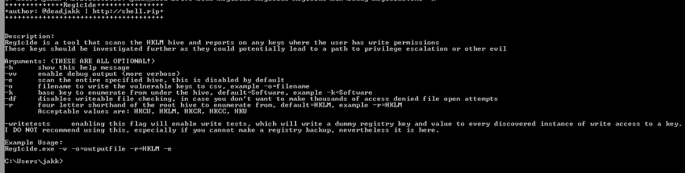
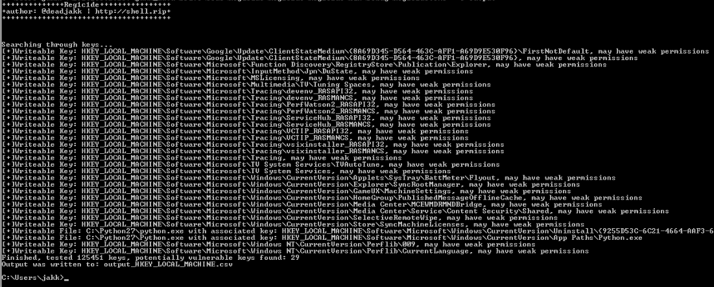

# Reg1c1de 
---
## Introduction:
Uploaded a new tool, something that I've written and I find it useful so I cleaned up the code, the output, and pushed it to my github [here](https://github.com/deadjakk/reg1c1de) along with a release since I know people hate compiling.
Overall it tries to be a straight-forward tool: it attempts to open every single registry key under the specified registry hive and reports on the result of the attempt if it is in fact, writeable. Then it will also review every value to see if they contain file extensions within them, if so, it checks if they are in fact a file, and proceeds to try and open those with writeable permissions as well (this can be disabled of course with -df flag, more on flags below). The idea is find writeable locations in registry or associated registry values that you can abuse for privilege escalation or whatever fun things you wish to do. *More info on what you can do with these permissions and how to abuse them is at the bottom of this page.
This admittedly, lazier method is of course in direct opposition to the method by which you wade through output from a much more comprehensive, detail-oriented tool like [AccessEnum](https://docs.microsoft.com/en-us/sysinternals/downloads/accessenum). There is definitely nothing wrong with these tools and they are the primary direction one should probably take when taking a "data-driven" approach.
However when you are not a walking calculator and only a humble hacker, you are likely just trying to get some privesc on a time-boxed assessment and the last thing you want to do is shuffle through a massive haystack for a needle that may not exist.  

TL;DR: this tool tries, in the most forthright way one can to answer the question: "Can the user that I am currently running as write to anything in places where it usually should not be able to write to things". Also it's loud, so be careful, NOT OPSEC SAFE.

##### A Couple More Notes:
I wrote it in C# since I feel that has fairly decent flexibility in how many ways it can be run, reflectively, executable, easily ported to powershell. You can even compile it with [ExportDLL](https://github.com/3F/DllExport) and used one of many methods by which to execute DLLs. 
This method is not without it's drawbacks, it goes without saying that a ton of attempts to open things with writeable permissions will likely not go unnoticed/unpunished, you were warned.. again, NOT OPSEC SAFE.

### The Tool Itself:
Reg1c1de can be run without any arguments and by default will scan everything under HKLM\Software, providing information about writeable registry keys and filepaths that are discovered. 
There is a bit of flexibility baked into it so I've highlighted some of the options I feel are most useful, though it does have a help menu so help yourself to that:
`-h` shows the FULL help menu, shown in the first image below
`-o=filename` it writes results to a csv file in a better format to parse through    
`-r=HKLM` specifies the root hive from which to begin scanning   
`-k=Software` specifies the first subkey from the hive to scan, using it as a root.   
`-e` this will scan the entire root hive that you have specified instead of one of it's subkeys. if this is selected the `-k` arg is ignored.  

### Help Output:

### Sample Run:

As you can see it reports back the number of writeable keys it located and how many were tested as well as files that it found. Additionally, output was written to a .csv filie since the `-o` option was selected.

### Okay... I can write, but how do I attac?
Short answer: get creative. I won't go super deep into this vector as registry attacks are not super new and others have done a great job already, one talk if you have 10 minutes is jake williams [here(with timestamp)](https://youtu.be/SHdM197sbIE?t=1193).   
Basically registry is the Windows answer to Linux's /etc/ directory. It holds a lot of configuration information for the programs that put them there, things such as "when was this program last run" and "what path do I go to for that dll" (see where this is going?). Of course Windows has actual configuration files as well within Program Files... or literally wherever a developer feels like he wants to put things, but registry is a massive hierarchical hive of configuration information and if you can dictate some of that information, or the files these keys point to, you can steal the box. 
So permissions, registry has permissions just like almost everything else in Windows, and just like every other permission in Windows, sometimes these are not configured properly. When you find something interesting that you can write or modify it may get you a privesc, or a vector by which to establish persistence. One example of this would be a registry key with a value named something like: "ExecutablePath" with the value: "C:\temp\update_workstation.exe", if you can change this path to something you have access to or even overwrite c:\temp\update_workstation.exe, then you may have something.
For a more in-depth look into how these things can be abused or general windows privesc, I cannot recommend enough checking out the video linked in the first sentence of this section.
